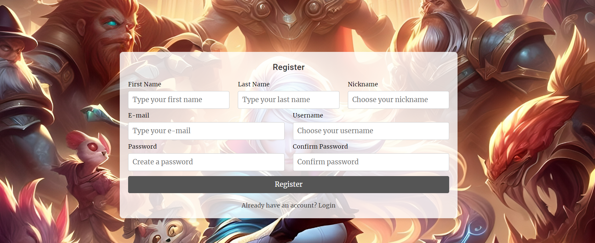
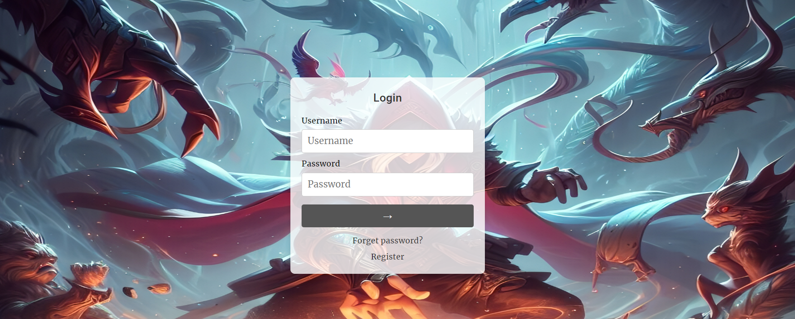
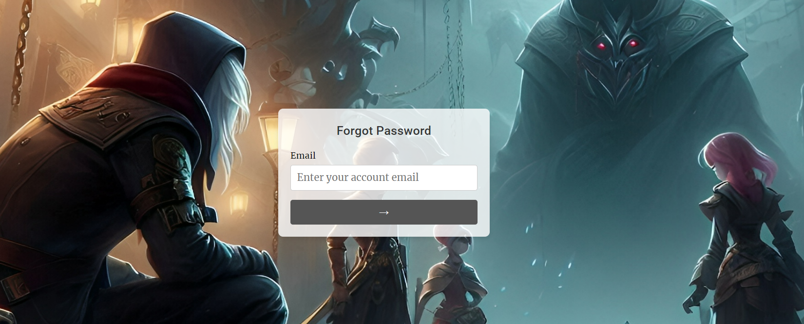
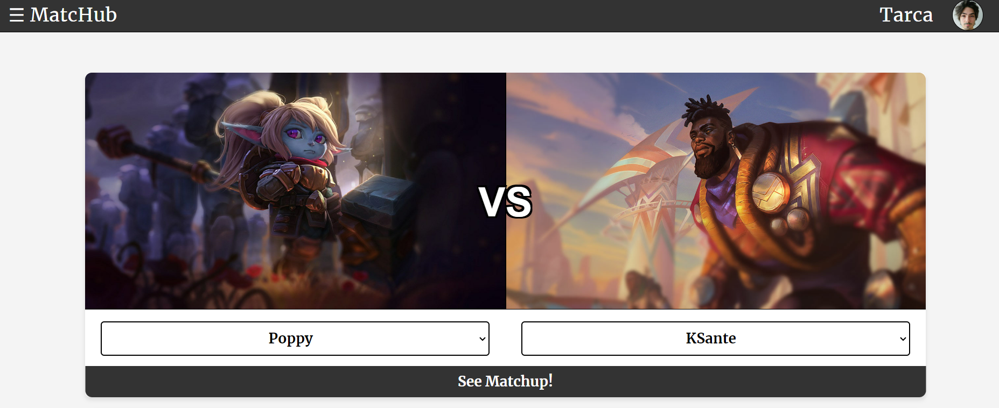
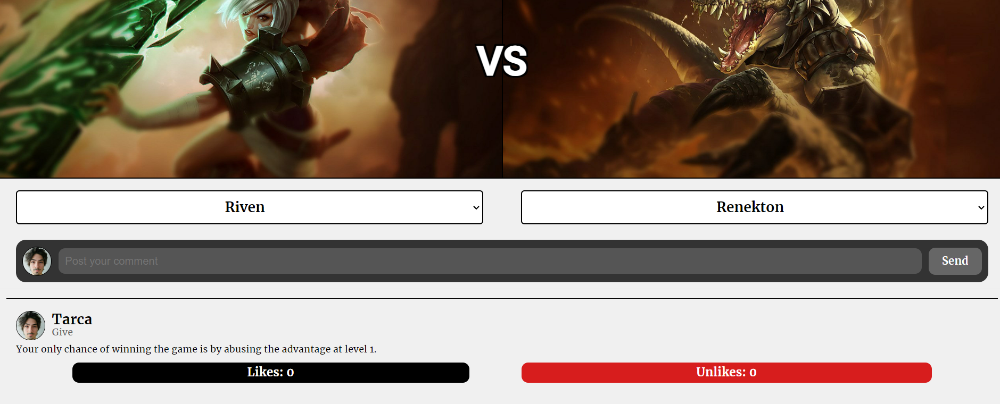
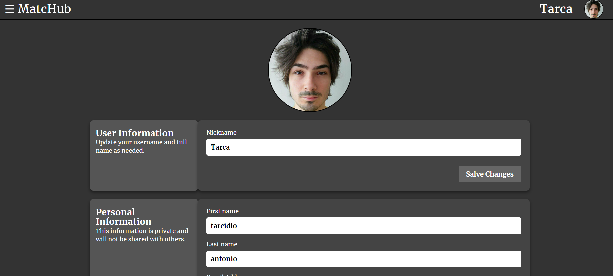
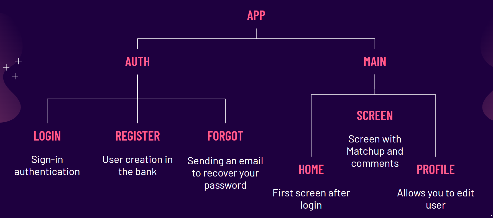

# MatcHub Web

## Overview

MatcHub is an interactive platform for League of Legends players, providing a space where users can explore and discuss the advantages and disadvantages of each game matchup. This project was developed during an internship and includes several complementary modules. Detailed information is available at the [main repository](https://github.com/tarcidio/matchub). This ReadMe aims to provide an overview of the developed interfaces and the user experience with the application.

## Table of Content

* [Videos](#videos)
* [Images](#images)
    * [Register](#register)
    * [Login](#login)
    * [Forgot Password](#forgot-password)
    * [Home](#home)
    * [Main Screen](#main-screen)
    * [Profile](#profile)
* [Components, Services, Guards, and Classes](#components-services-guards-and-classes)
* [Observations](#observations)

## Videos

Below are some videos recorded for readers who want to understand how the application works without having to upload the container:

* [Demo of the "Register" page](https://www.youtube.com/watch?v=hcu2P-2pc50&list=PLp_jKiMekEMARL6Nt7IrfuCg6Y9INYrZ9)
* [Demo of the "Login" page](https://www.youtube.com/watch?v=DQicS6xI6QA&list=PLp_jKiMekEMARL6Nt7IrfuCg6Y9INYrZ9&index=2)
* [Demo of the "Home" and "Screen" page](https://www.youtube.com/watch?v=AjJEWKgTsF4&list=PLp_jKiMekEMARL6Nt7IrfuCg6Y9INYrZ9&index=3)
* [Demo of the "Profile" page](https://www.youtube.com/watch?v=DlC8ZJvj3S4&list=PLp_jKiMekEMARL6Nt7IrfuCg6Y9INYrZ9&index=4)

## Images

For a more static view and within the GitHub platform, we also provide some images:

### Register

---

### Login

---

### Forgot Password

---

### Home

---

### Main Screen

---

### Profile

## Components, Services, Guards, and Classes

Angular is a front-end web development framework maintained by Google, ideal for creating dynamic and large-scale web applications. Using TypeScript, it offers a component-based architecture, dependency injection, and integrated tools like Angular CLI, facilitating maintenance and scalability. Compared to React and Vue, Angular is more robust and structured, making it preferred in corporate environments. Despite its steep learning curve, it was chosen for the web development study of this application.

In this project, the component tree was divided as follows:

For a better understanding of the core entities, [it is recommended to read the repository's ReadMe](https://github.com/tarcidio/matchub-api) related to the project's API. Below is a brief explanation:

* **Auth**: The Auth module manages authentication, including user registration, login, and password recovery. It also stores information about guards and services. The Auth module consists of the following submodules:
    * **Login**: Manages the login interface.
    * **Register**: Manages the registration interface.
    * **Forgot**: Manages the password recovery interface.
* **Main**: The Main module manages the primary part of MatcHub, such as accessing comments on a matchup. It consists of the following submodules:
    * **Home**: Manages the initial screen after login, from where it is possible to navigate to the comments of a matchup.
    * **Screen**: Manages the matchup interface.
    * **Profile**: Manages user information.
* **Shared**: Module for shared components, such as footer, nav, and modals.

Most of the services, responsible for interacting with the API, retrieving data, and performing non-idempotent actions, are concentrated in the Main module, such as reading and altering comments and reading champions. The Auth module also has services for managing login, registration, and other authentication features. In Auth, there are also two guard classes that ensure page access depending on the user's authentication state (logged in or not logged in).

Finally, several DTO classes were created for communication with the API. The Store class was also created to store the application's state, such as logged-in user information. This architecture is a simplified version of the Redux architecture, containing only the Store class and not the other related artifacts.

## Observations

Finally, it is important to highlight that the database and API modeling foresee specific screens for administrators and moderators, with routes already implemented in the API. However, these functionalities have not yet been developed on the front-end and are listed as future tasks (see issues). Additionally, it is planned to allow non-logged-in users to read the comments of matchups, but this functionality has also not been implemented so far, so only logged-in users can access MatcHub.

